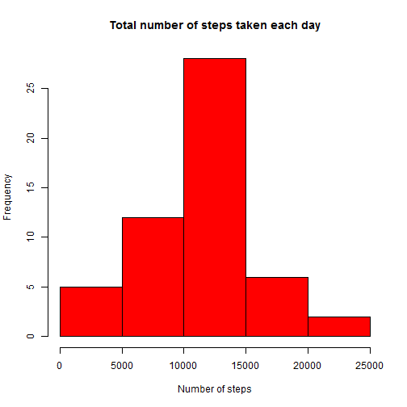
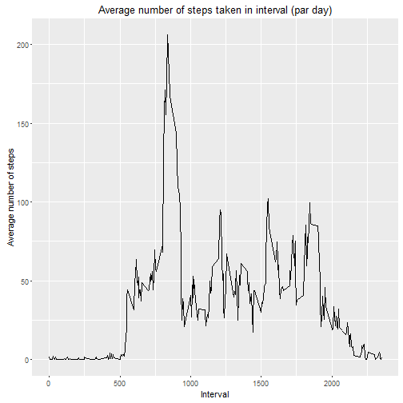
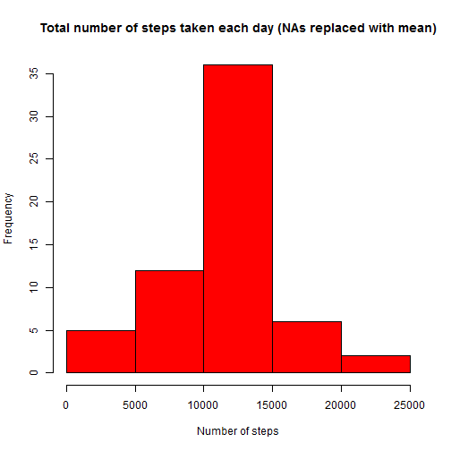
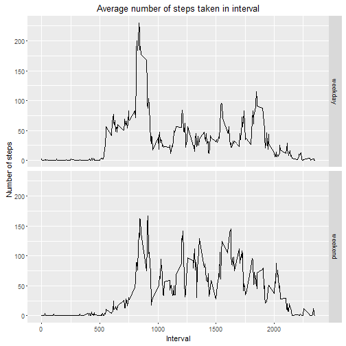

##Loading and preprocessing the data
**1. Loading data.**  
Checking if data exists in working folder.If not, download it and unzip it

```r
 if(file.exists("activity.csv")==FALSE)
    {
        if(file.exists("repdata%2Fdata%2Factivity.zip")==FALSE)
        {
            print("Loading data...")
            download.file("https://d396qusza40orc.cloudfront.net/repdata%2Fdata%2Factivity.zip","repdata%2Fdata%2Factivity.zip")
        }
        print("unzipping...")
        unzip("repdata%2Fdata%2Factivity.zip")
    }
 activity<-read.csv("activity.csv")
```
**2. Process/transform the data (if necessary) into a format suitable for your analysis**  
Transform "date" column to Date format

```r
 activity$date<-as.Date(activity$date,"%Y-%m-%d")
```
##What is mean total number of steps taken per day?
We ignore missing values for this part of assignment  
**1. Calculate the total number of steps taken per day**  

```r
steps_daily<-tapply(activity$steps,activity$date,sum)
```
**2. Make a histogram of the total number of steps taken each day**  

```r
hist(steps_daily,col="red",xlab="Number of steps",main="Total number of steps taken each day")
```


</br>**3.Calculate and report the mean and median of the total number of steps taken per day**  

```r
mean(steps_daily,na.rm=T)
```

```
## [1] 10766.19
```

```r
median(steps_daily,na.rm=T) 
```

```
## [1] 10765
```
##What is the average daily activity pattern?
**1. Make a time series plot (i.e. type = "l") of the 5-minute interval (x-axis) and the average number of steps taken, averaged across all days (y-axis)**  

```r
library(ggplot2)
```

```
## Want to understand how all the pieces fit together? Buy the
## ggplot2 book: http://ggplot2.org/book/
```

```r
act_int_mean<-aggregate(steps~interval,data=activity,mean)
ggplot(act_int_mean,aes(interval,steps))+geom_line()+xlab("Interval")+ylab("Average number of steps")+ggtitle("Average number of steps taken in interval (par day)")
```


</br>**2. Which 5-minute interval, on average across all the days in the dataset, contains the maximum number of steps?**  

```r
 subset(act_int_mean,steps==max(act_int_mean$steps,na.rm=T),select=c("interval","steps"))
```

```
##     interval    steps
## 104      835 206.1698
```
##Imputing missing values
There are a number of days/intervals where there are missing values (coded as NA). The presence of missing days may introduce bias into some calculations or summaries of the data.  
**1. Calculate and report the total number of missing values in the dataset (i.e. the total number of rows with NAs)** 

```r
sum(is.na(activity$steps))
```

```
## [1] 2304
```
**2. We will use mean of particular 5-minute interval for filling NA values**  
**3. Create a new dataset that is equal to the original dataset but with the missing data filled in.**  

```r
activity_nona<-activity
count<-1
for(i in activity_nona$steps) 
    { 
        if(is.na(i)==T) 
            {
                activity_nona$steps[count]=tapply(activity$steps,activity$interval==activity_nona$interval[count],mean,na.rm=TRUE)[2]
            }
            count=count+1
    }
```
**4. Make a histogram of the total number of steps taken each day and Calculate and report the mean and median total number of steps taken per day. Do these values differ from the estimates from the first part of the assignment? What is the impact of imputing missing data on the estimates of the total daily number of steps?**  
Mean and median values have changes, they are higher now, because there were some NA values for particular days, which were counted as 0, when mean and median values were calculated. Now we have imputed values, which are obviously higher then 0 and raise mean/median values.  
</br>


```r
steps_daily_nona<-tapply(activity_nona$steps,activity_nona$date,sum)
hist(steps_daily_nona,col="red",xlab="Number of steps",main="Total number of steps taken each day (NAs replaced with mean)")
```



```r
mean(steps_daily_nona,na.rm=T)
```

```
## [1] 10766.19
```

```r
median(steps_daily_nona,na.rm=T)
```

```
## [1] 10766.19
```
##Are there differences in activity patterns between weekdays and weekends?
**1. Create a new factor variable in the dataset with two levels ñ ìweekdayî and ìweekendî indicating whether a given date is a weekday or weekend day.**    

```r
activity_nona$weekday[1]<-"weekday"
    for(i in 1:length(activity_nona$date)) 
    { 
        if(weekdays(activity_nona$date[i])=="ÒÛ··ÓÚ‡" || weekdays(activity_nona$date[i])=="‚ÓÒÍÂÒÂ̸Â") 
        {
            activity_nona$weekday[i]="weekend"
        }
    }
activity_nona$weekday<-as.factor(activity_nona$weekday)
```
**2. Make a panel plot containing a time series plot (i.e. type = "l") of the 5-minute interval (x-axis) and the average number of steps taken, averaged across all weekday days or weekend days (y-axis).**  

```r
act_mean_nona<-aggregate(steps~interval+weekday,data=activity_nona,mean)
ggplot(act_mean_nona,aes(interval,steps))+geom_line()+facet_grid(weekday~.)+xlab("Interval")+ylab("Number of steps")+ggtitle("Average number of steps taken in interval")
```


